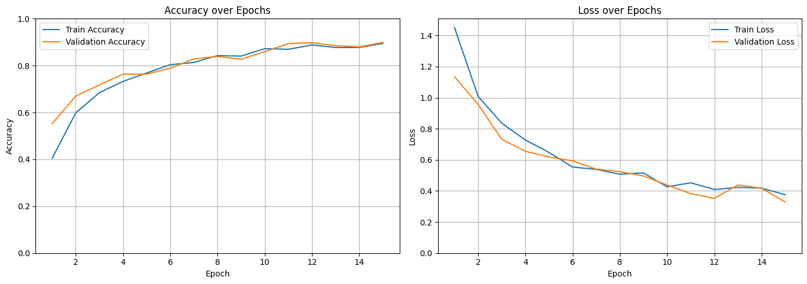
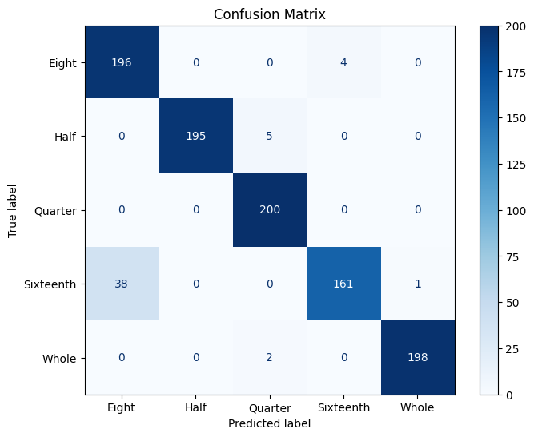
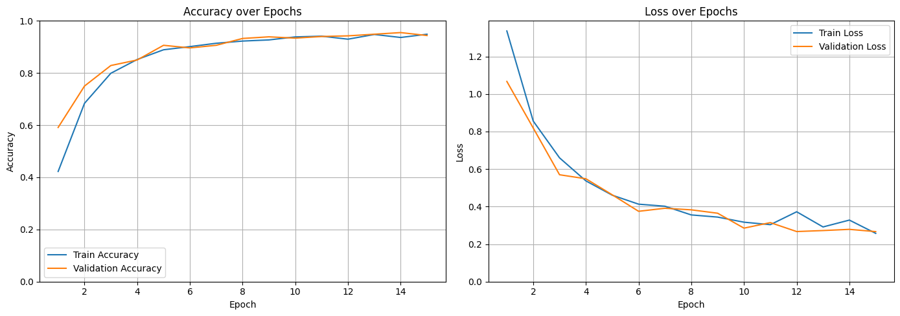
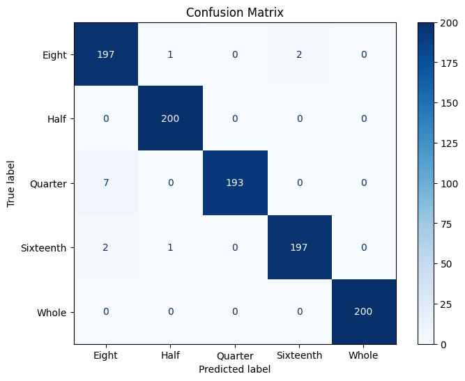

# Detección de notas usando Machine Learning

Ricardo Adolfo Fernández Alvarado - A01704813

## Abstract

Este proyecto presenta un sistema de clasificación de imágenes para la detección de figuras musicales utilizando técnicas de Machine Learning, específicamente redes neuronales convolucionales (CNN).

El objetivo es categorizar imágenes de notas musicales en cinco clases: redonda, blanca, negra, corchea y semicorchea. Se empleó un dataset de 5000 imágenes extraído de Kaggle, con un preprocesamiento que incluyó partición en conjuntos de entrenamiento, validación y prueba, así como técnicas de data augmentation para mejorar la robustez del modelo.

La arquitectura propuesta se basa en capas convolucionales y densas, siguiendo enfoques del estado del arte, y se evaluó utilizando métricas de precisión y recall, además de matrices de confusión. Se implementó una versión mejorada del modelo añadiendo una capa convolucional adicional y ajustando el MaxPooling, lo que resultó en un desempeño superior, especialmente en la diferenciación de corchea y semicorchea.

Los resultados muestran que la arquitectura propuesta es efectiva, aunque se identifican limitaciones al aplicar el modelo a datos externos, sugiriendo la necesidad de ampliar y diversificar el dataset para mejorar la generalización. El trabajo concluye que el uso de CNN es viable para la identificación de símbolos musicales, destacando la importancia del preprocesamiento y la selección adecuada de datos de entrenamiento.

## Introducción

En las partituras musicales existen ciertos glifos conocidos como las [figuras musicales](https://es.wikipedia.org/wiki/Figura_musical). Estos glifos representan el ritmo de las notas en una canción, atribuyendo a cada glifo un valor específico.

Este proyecto busca utilizar Machine Learning para generar un clasificador de imágenes que categorize imágenes en las siguientes categorías:

- Redonda
- Blanca
- Negra
- Corchea
- Semi Corchea

## Marco Teórico

Actualmente, existen diversas técnicas para el reconocimiento óptico de imágenes de partituras musicales. Cómo se muestra en [1], se pueden utilizar capas convolucionales para extraer los patrones de las imágenes que contienen símbolos musicales. Este proceso en específico utiliza RNNs para poder predecir el siguiente símbolo musical, ya que el dataset que se utiliza está escrito a mano, por lo que los símbolos varían entre sí y entre piezas.

Adicionalmente, en [2] se utiliza una combinación de CNN y RNN para convertir partituras musicales en su representación [\*\*kern](https://www.humdrum.org/rep/kern/). En su modelo de entrenamiento se utiliza una CNN para extraer las características importantes (las notas en sí mismas), mientras que la RNN se utiliza para generar la salida en formato \*\*kern.

Tomando estos procedimientos, se pueden utilizar las configuraciones de capas convolucionales como lo hacen estos artículos científicos para extraer las características importantes de las imágenes, acompañado de capas densas para clasificarlas.

## Dataset

El dataset fue extraído de [Kaggle](https://www.kaggle.com/datasets/kishanj/music-notes-datasets?resource=download). El mismo cuenta con 5000 imágenes, 1000 sobre cada una de las categorías mencionadas en la introducción. Cada imagen consta de una nota, en una resolución de 64x64 píxeles en blanco y negro.

### Preprocesamiento

Se utilizó el 20% de los datos para probar el modelo una vez que esté entrenado, 16% para validación del modelo y finalmente el 64% restante para el entrenamiento del mismo.

En cuanto a Data Generation, se considera que existen suficientes imágenes para el entrenamiento del modelo, por lo que no se generaron imágenes adicionales a las que el dataset ya tenía.

En el tema de Data Augmentation, se usa la API de preprocesamiento de Keras para modificar ligeramente las imágenes, agregando una ligera rotación, zoom y modificación elástica a las imágenes. Se tuvo cuidado en la modificación por rotación, ya que las figuras musicales se volverían incorrectas si se rotan demasiado. Adicionalmente, se evitó el voltear las imágenes en ambos ejes, ya que de igual manera, las figuras se volverían incorrectas.

Dado que las imágenes son en escala de grises, se cargaron usando un solo canal para indicar el color de cada píxel. Finalmente, se realizó el escalado de las imágenes para pasar las de un rango de 0 a 255 a 0 a 1.

## Modelo

La arquitectura del modelo se basó en lo visto en los artículos mencionados. El modelo tiene las siguientes capas:

- Conv2D
- MaxPooling
- Conv2D
- MaxPooling
- Flatten
- Dense
- Dense

Las capas convolucionales siguen el ejemplo de los artículos, donde se usan para la extracción de los patrones, además de ser acompañadas de MaxPooling que limitan el tamaño de la imagen entre capas, para encontrar distintos patrones en cada capa. Finalmente se agrega la capa de Flatten, para convertir la matriz en un vector y se usan las capas densas para la clasificación final.

El modelo usa Adam como su optimizador, análogo a lo visto en los artículos.

### Métricas

Para el entrenamiento del modelo se usan dos métricas principalmente, la Precision y el Recall. Estas métricas son comúnmente usadas en el reconocimiento de símbolos. Los modelos actuales pueden llegar a tener un recall de hasta 99% en diversos casos.

### Modelo Refinado

Como parte de las posibles mejoras del modelo, se agregó una capa convolucional extra, para aumentar la cantidad de patrones que puede reconocer la red neuronal. Adicionalmente, se hicieron ajustes al MaxPooling, para reducir menos la información entre cada capa, esperando que pudiese encontrar más detalles en las imágenes.

La arquitectura final de este modelo mejorado es la siguiente:

- Conv2D
- MaxPooling
- Conv2D
- MaxPooling
- Conv2D
- MaxPooling
- Flatten
- Dense
- Dense

### Loss

Para el loss, dado que es un problema de clasificación con más de 2 clases, se usó sparse categorical crossentropy como fórmula para el cálculo del error.

## Resultados

Para la evaluación de resultados, es muy común usar una herramienta como la matriz de confusión para observar en una primera instancia los resultados obtenidos por el modelo. Adicionalmente, se usarán las métricas establecidas anteriormente para la evaluación del mismo, comparando su desempeño con el del estado del arte.

### Evaluación inicial

En el entrenamiento podemos ver como el modelo aprende reduciendo el loss y aumentando el accuracy sobre cada época.

  
   
  <em>Gráfica 1. Loss y Accuracy por épocas</em>

El modelo inicial tuvo un desempeño por debajo del estado del arte, con las siguientes métricas:

| Clase        | Precision | Recall |
| ------------ | :-------: | :----: |
| Corchea      |   0.84    |  0.98  |
| Blanca       |   1.00    |  0.97  |
| Negra        |   0.97    |  1.00  |
| Semi Corchea |   0.98    |  0.81  |
| Redonda      |   0.99    |  0.99  |

<em>Tabla 1. Resultados iniciales del modelo</em>

A continuación se incluye la matriz de confusión:

  
   
  <em>Gráfica 2. Matriz de confusión inicial</em>

Como se puede observar, el modelo estaba prediciendo muy bien casi todas las categorías, generando mucha confusión entre los valores de Corchea y Semi Corchea, ya que la precisión y el recall de estas categorías está bastante por debajo del resto de las categorías. Esto indica que probablemente el modelo no está reconociendo estos patrones más pequeños entre una y otra, y se espera que un modelo con más capas mejore en la diferenciación de estas dos categorías.

  
  
   
  <em>Imagen 1. Comparación entre una Corchea y una Semi Corchea</em>

### Evaluación del modelo mejorado

El modelo mejorado tuvo un resultado más cercano a aquel del estado del arte, mejorando en las categorías en las que estaba fallando anteriormente.

  
   
  <em>Gráfica 3. Loss y Accuracy por épocas del modelo mejorado</em>

El modelo mejorado tuvo las siguientes métricas:

| Clase        | Precision | Recall |
| ------------ | :-------: | :----: |
| Corchea      |   0.96    |  0.98  |
| Blanca       |   0.99    |  1.00  |
| Negra        |   1.00    |  0.96  |
| Semi Corchea |   0.99    |  0.98  |
| Redonda      |   1.00    |  1.00  |

<em>Tabla 2. Resultados del modelo mejorado</em>

Estas mejoras también se ven reflejadas en la matriz de confusión:

  
   
  <em>Gráfica 4. Matriz de confusión mejorada</em>

Como se puede observar en los resultados, la capa convolucional extra aunada a los ajustes en el MaxPooling mejoran bastante los resultados del modelo, específicamente en las categorías en las que anteriormente fallaba. Esto se debe principalmente a que la capa convolucional extra ayuda a identificar los patrones más detallados, como los presentes entre las corcheas y las semi corcheas.

### Uso con datos externos

Al probar el modelo con imágenes análogas a aquellas dentro del dataset, su desempeño es bastante bueno, sin embargo aún existen casos en los que el modelo no predice de manera correcta. Un caso principal es que si la imagen no es una nota en el formato clásico de partituras (cómo lo sería una imagen tipo caricatura) el modelo falla en su predicción.

Adicionalmente, un punto crítico de estas fallas se encuentra en las notas sobre el pentagrama. Cuando las notas se encuentran sobre un pentagrama, como en el caso de una partitura musical, el modelo muchas veces confunde las notas entre sí debido a los datos provenientes de las rayas en el fondo de la imagen.

Para resolver estas fallas se podría ampliar el dataset para incluir notas en diversos estilos de dibujo. En el caso de las notas sobre el pentagrama, se podrían agregar notas con lineas de fondo o incluso aumentar el dataset original agregando rayas artificiales en el fondo de las imágenes existentes, para ayudar al modelo a identificar estas imágenes aún si hay ruido.

## Conclusiones

Implementar redes neuronales convolucionales para la identificación de símbolos musicales es algo factible. El modelo que se presenta en este documento obtuvo un resultado favorable dentro del estado del arte, sin embargo es importante tener en cuenta los problemas que nacen del uso del modelo con datos externos a aquellos en el set de entrenamiento y validación. Por lo tanto, aunque la arquitectura ha demostrado ser factible, es importante tener en cuenta los datasets que se utilizan para entrenarla, y es crítico ajustar el mismo para alcanzar los resultados que se estén buscando.

## Fuentes

[1] A. Baró, P. Riba, J. Calvo-Zaragoza, and A. Fornés, "From Optical Music Recognition to Handwritten Music Recognition: A baseline," Pattern Recognition Letters, vol. 123, pp. 1–8, Feb. 2019, doi: 10.1016/j.patrec.2019.02.029.

[2] X.-Y. Zhang and J.-L. Hsu, "Full-Scale piano score recognition," Applied Sciences, vol. 15, no. 5, p. 2857, Mar. 2025, doi: 10.3390/app15052857.
